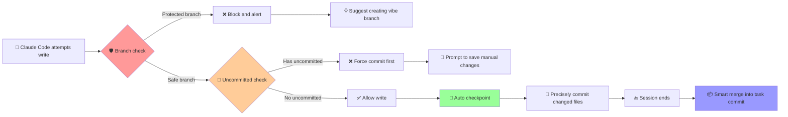

<div align="center">

# 🛡️ Claude Code Guardrails

<p align="center">
  <strong>Smart Guardrail System for Safer Claude Code Development</strong>
</p>

<p align="center">
  <a href="https://github.com/wangbooth/claude-code-guardrails/stargazers">
    
  </a>
  <a href="https://github.com/wangbooth/claude-code-guardrails/forks">
    
  </a>
  <a href="https://github.com/wangbooth/claude-code-guardrails/blob/main/LICENSE">
    
  </a>
  <a href="https://github.com/wangbooth/claude-code-guardrails/issues">
    
  </a>
</p>

<p align="center">
  <strong>🔥 If this project helps you, please click the ⭐ Star in the top right corner to support us!</strong>
</p>

<p align="center">
  <a href="README.md">🇺🇸 English</a> | <a href="README_CN.md">🇨🇳 中文</a>
</p>

</div>

---

## 🚨 Pain Points: Claude Code's "Dangerous Moments"

Have you ever encountered these frustrating scenarios while Vibe Coding?

❌ **Direct modification on main branch** → One mistake, important code gets overwritten  
❌ **Interrupted modifications** → Intermediate artifacts lost, unable to rollback to specific states  
❌ **Chaotic multiple modifications** → Don't know which change introduced the bug  
❌ **Accidentally deleted important files** → No timely commits, game over  
❌ **Manual changes overwritten** → AI directly overwrites uncommitted manual changes, cannot distinguish code ownership  

## 💡 Solution: Claude Code Guardrails

> **Triple Security Mechanism**: 🛡️ **Pre-write Interception Alert** + 📸 **Precise Snapshot Commits** + 🔄 **Smart Merge Archiving**

✅ **Protected branch interception** → Automatically blocks writes to main branch, suggests creating feature branch  
✅ **Uncommitted changes protection** → Blocks when manual changes are uncommitted, forces commit first to avoid overwriting  
✅ **File-level precise snapshots** → Each modification only commits changed files, avoiding noise  
✅ **Smart backup mechanism** → Automatic backup before gitignore file modifications  
✅ **Safe history merging** → Multiple checkpoints intelligently merged into clean task commits

<div align="center">

### 🎉 Start experiencing now!

<p>
  <a href="#-quick-start">
    
  </a>
  &nbsp;&nbsp;
  <a href="https://github.com/wangbooth/claude-code-guardrails/stargazers">
    
  </a>
</p>

</div>

---

## ✨ Core Features

<table>
<tr>
<td width="50%">

### 🛡️ Dual Security Protection
- **Protected branch interception** 
- **Uncommitted changes detection**
- Pre-write blocking alerts
- Smart suggestion to create `vibe` branch
- Force commit manual changes before continuing

</td>
<td width="50%">

### 📸 Precise Snapshots
- **File-level snapshot commits**
- Avoid noise from `git add .`
- Only commit currently changed files
- Preserve complete modification history

</td>
</tr>
<tr>
<td width="50%">

### 🔄 Smart Backup
- **Automatic gitignore file backup**
- Backup to `.claude/backups/` before modifications
- Bilingual friendly reminders
- Prevent loss of important config files

</td>
<td width="50%">

### 📦 History Organization
- **Safe squash merging**
- Multiple checkpoints merged into tasks
- Don't break protected branch history
- Keep Git history clean

</td>
</tr>
</table>

### 🔧 Perfect Compatibility
- ✅ **Don't overwrite existing Claude Code Hooks** - Intelligently merge `.claude/settings.json`
- ✅ **Backup + Deduplication + Idempotent** - Safe even with multiple installations
- ✅ **Coexist with user hooks** - Don't affect existing workflows

---

## 🆚 Compare with Other Solutions

<table>
<tr>
<th width="25%">Solution</th>
<th width="25%">Traditional Approach</th>
<th width="25%">Manual Backup</th>
<th width="25%"><strong>🛡️ Guardrails</strong></th>
</tr>
<tr>
<td><strong>Branch Protection</strong></td>
<td>❌ Rely on human memory</td>
<td>❌ Remedial action after the fact</td>
<td>✅ Automatic interception alerts</td>
</tr>
<tr>
<td><strong>Version Tracking</strong></td>
<td>❌ Lose intermediate states</td>
<td>⚠️ Manual copy-paste</td>
<td>✅ Precise automatic snapshots</td>
</tr>
<tr>
<td><strong>History Organization</strong></td>
<td>❌ Messy commit records</td>
<td>❌ Cannot trace back</td>
<td>✅ Smart merge archiving</td>
</tr>
<tr>
<td><strong>Ease of Use</strong></td>
<td>⚠️ Requires experience</td>
<td>❌ Cumbersome and error-prone</td>
<td>✅ One-click install and use</td>
</tr>
</table>

---

## 🧰 Prerequisites

* **Git** installed and initialized (configured with `user.name` / `user.email`)
* **Claude Code** installed (version supporting Hooks and `PreToolUse exit=2` blocking)
* **jq** (for parsing Hook input JSON)

  * macOS: `brew install jq`
  * Ubuntu: `sudo apt-get install -y jq`

---

## 🚀 Quick Start

<div align="center">

### 🎯 Choose Installation Method

</div>

<table>
<tr>
<td width="50%">

### 🌟 Recommended: One-Click Installation
**Smart merge, safe and worry-free**

```bash
# Project-level installation
curl -fsSL https://raw.githubusercontent.com/wangbooth/claude-code-guardrails/main/install.sh | bash
```

```bash
# Global installation
curl -fsSL https://raw.githubusercontent.com/wangbooth/claude-code-guardrails/main/install.sh | bash -s -- --global
```

</td>
</tr>
</table>

<table>
<tr>
<td width="50%">

### 📁 Method 2: Manual Copy
**Intuitive and transparent, complete control**

```bash
cp -r .claude/ /path/to/your-project/
chmod +x /path/to/your-project/.claude/hooks/guardrails/*.sh
```

</td>
</tr>
</table>

<div>

### ✨ Installation Script Features

🔄 **Smart merge** - Don't overwrite existing configurations  
💾 **Automatic backup** - Backup settings.json before changes  
🔁 **Idempotent safety** - Multiple runs have no side effects  
🧹 **Deduplication** - Avoid duplicate configuration items

</div>

---

## 🗑️ Uninstallation

```bash
# Project-level uninstall
curl -fsSL https://raw.githubusercontent.com/wangbooth/claude-code-guardrails/main/uninstall.sh | bash

# Keep script files, only remove from settings.json
curl -fsSL https://raw.githubusercontent.com/wangbooth/claude-code-guardrails/main/uninstall.sh | bash -s -- --keep-scripts

# Global uninstall
curl -fsSL https://raw.githubusercontent.com/wangbooth/claude-code-guardrails/main/uninstall.sh | bash -s -- --global
```

---

## 🗂️ Directory Structure

```
.
├─ .claude/
│  ├─ settings.json                 # Hook entry and matching rules (template)
│  └─ hooks/
│     ├─ guardrails/
│     │  ├─ guard-branch.sh         # Pre-write branch guard (protected branch blocking)
│     │  ├─ auto-commit.sh          # Per-modification precise snapshot commits
│     │  └─ squash-checkpoints.sh   # Stop/Compact stage safe merging
├─ install.sh                       # One-click installation (merge/backup/dedup/idempotent)
├─ uninstall.sh                     # One-click uninstall (can keep scripts)
├─ README.md
├─ LICENSE                          # MIT
```

---

## 📺 Effect Demo

<div align="center">

### 🎬 Workflow Overview



</div>

## 🧪 Usage Examples

### Scenario 1: Protected Branch Interception

Attempting to write on protected branch → **Blocked and alerted**, terminal suggests creating `vibe` branch:

```
⚠️  Branch 'main' is protected.
   Current branch 'main' is protected.

It's recommended to create/switch to a vibe branch before making changes:
建议创建/切换到 vibe 分支再修改，例如：
  git checkout -b vibe/20250811142530-claude
```

### Scenario 2: Uncommitted Changes Protection

Detected uncommitted manual changes → **Blocked and prompted to commit first**:

```
⚠️  Detected uncommitted changes in the repository.
   检测到仓库中有未提交的更改。

There are uncommitted changes that may be lost if AI overwrites them.
存在未提交的更改，如果被 AI 覆盖可能导致代码丢失。

Consider committing these changes first:
建议先提交这些更改：
  git add .
  git commit -m "Save work in progress"
```

### Scenario 3: Normal Workflow

Switch to vibe branch and continue working → Auto checkpoint after each `Write/Edit/MultiEdit`:

```
checkpoint: Write src/LoginForm.tsx - 14:25
checkpoint: Edit src/types.ts - 14:26
```

   If modifying gitignore files, you'll receive backup reminders:
   
```
📦 Backup Notice: '.env' is a gitignored file. A backup has been saved to '.claude/backups/.env.20250811-142530' before claude code modification.
📦 备份提醒: '.env' 是 gitignore 文件，claude code 修改前已备份到 '.claude/backups/.env.20250811-142530'
```

### Scenario 4: Session End Organization

End session `stop` / trigger `compact` → Automatically merge multiple checkpoints **into one task commit**:

```
task: modify LoginForm.tsx, types.ts - 2025-08-11
```

---

## 🛡️ Security Strategy and Best Practices

* **Branch Protection**: Default protection for `main|master|dev|release*`, adjustable in `guard-branch.sh`.
* **Don't break public history**: No squash on protected branches; only merge checkpoints when "no upstream or ahead>0".
* **Collaboration recommendation**: More stable when combined with remote branch protection (no force push/requires PR).

---

## 🔧 Customization Guide

* **Commit message conventions**: Change `auto-commit.sh` to `chore(checkpoint): ...`; Stop stage outputs `vibe/fix/...` types (Conventional Commits).
* **Stricter write paths**: To completely prevent "direct file write tools", only allow custom MCP write tools in `PreToolUse`, block generic `Write|Edit|MultiEdit`.
* **External integration**: Call your CLI/API in `PostToolUse` or `Stop` (tickets, PRs, message notifications, etc.).

---

## ❓ Frequently Asked Questions (FAQ)

**Q: Will it overwrite my existing hooks?**

A: No. The installation script uses `jq` to **merge** `.claude/settings.json`, only **appends and deduplicates** for the same `matcher`; and generates `.bak.*` backup before writing back.

**Q: If I manually modified code but haven't committed yet, can Claude Code still continue working?**

A: No. guard-branch.sh will detect uncommitted changes and block the operation, prompting you to commit first. This prevents AI from overwriting your manual modifications, ensuring clear and traceable code ownership.

**Q: Will multiple hooks execute in order?**

A: Multiple hooks matched by the same event execute in **parallel**; if strict ordering is needed, write multiple commands in the same script for serial execution.

**Q: Does it support Windows?**

A: Scripts are based on POSIX shell. Windows users are recommended to use WSL or Unix-like environments.

---

## 🌟 Community Support

<div align="center">

### 💝 Find it useful? Please support us!

<p>
  <a href="https://github.com/wangbooth/claude-code-guardrails/stargazers">
    
  </a>
  &nbsp;&nbsp;
  <a href="https://github.com/wangbooth/claude-code-guardrails/fork">
    
  </a>
</p>

<p>
  <strong>⚡ Triple action: Star ⭐ + Fork 🍴 + Share 📢</strong>
</p>

### 🤝 Contributing

<table>
<tr>
<td align="center" width="33%">

**🐛 Found a Bug**
<br/>
[Submit Issue](https://github.com/wangbooth/claude-code-guardrails/issues/new)

</td>
<td align="center" width="33%">

**💡 Feature Suggestion**
<br/>
[Feature Request](https://github.com/wangbooth/claude-code-guardrails/issues/new)

</td>
<td align="center" width="33%">

**🔀 Code Contribution**
<br/>
[Submit PR](https://github.com/wangbooth/claude-code-guardrails/pulls)

</td>
</tr>
</table>

### 📊 Project Stats

<p>
  
  
  
</p>

</div>

---

## 📄 License

<div align="center">

This project is licensed under the **MIT License**, see [LICENSE](LICENSE) file for details

**⭐ If this project helps you, please click Star to support us! ⭐**

</div>

---

<div align="center">

**🛡️ Chase the vibe, but honor the craft. 🛡️**

</div>