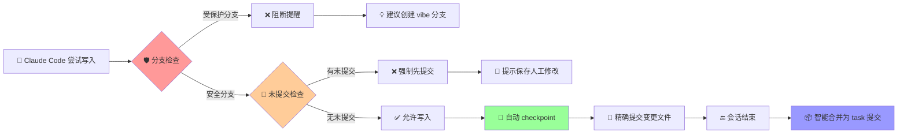

<div align="center">

# 🛡️ Claude Code Guardrails

<p align="center">
  <strong>让 Claude Code 开发更安全的智能护栏系统</strong>
</p>

<p align="center">
  <a href="https://github.com/wangbooth/claude-code-guardrails/stargazers">
    
  </a>
  <a href="https://github.com/wangbooth/claude-code-guardrails/forks">
    
  </a>
  <a href="https://github.com/wangbooth/claude-code-guardrails/blob/main/LICENSE">
    
  </a>
  <a href="https://github.com/wangbooth/claude-code-guardrails/issues">
    
  </a>
</p>

<p align="center">
  <strong>🔥 如果这个项目对您有帮助，请点击右上角的 ⭐ Star 支持我们！</strong>
</p>

<p align="center">
  <a href="README.md">🇺🇸 English</a> | <a href="README_CN.md">🇨🇳 中文</a>
</p>

</div>

---

## 🚨 痛点：Claude Code 的「危险瞬间」

在 Vibe Coding 的时候，您是否遇到过这些令人崩溃的场景？

❌ **在主分支直接修改** → 一个手抖，重要代码被覆盖  
❌ **修改过程中断** → 中间产物丢失，无法回滚到特定状态  
❌ **多次修改混乱** → 不知道哪次改动引入了 bug  
❌ **误删重要文件** → 没有及时提交，直接 GG  
❌ **人工修改被覆盖** → AI 直接覆盖未提交的手动更改，无法区分代码归属  

## 💡 解决方案：Claude Code Guardrails

> **三重安全机制**：🛡️ **写前拦截提醒** + 📸 **精确快照提交** + 🔄 **智能合并归档**

✅ **受保护分支拦截** → 主分支写入前自动阻断，提示创建功能分支  
✅ **未提交更改保护** → 检测到人工修改未提交时阻断，强制先提交避免覆盖  
✅ **按文件精确快照** → 每次修改仅提交变更文件，避免噪音  
✅ **智能备份机制** → gitignore 文件修改前自动备份  
✅ **安全历史合并** → 多个 checkpoint 智能合并为干净的 task 提交

<div align="center">

### 🎉 现在就开始体验！

<p>
  <a href="#-快速开始">
    
  </a>
  &nbsp;&nbsp;
  <a href="https://github.com/wangbooth/claude-code-guardrails/stargazers">
    
  </a>
</p>

</div>

---

## ✨ 核心特性

<table>
<tr>
<td width="50%">

### 🛡️ 双重安全保护
- **受保护分支拦截** 
- **未提交更改检测**
- 写入前阻断提醒
- 智能建议创建 `vibe` 分支
- 强制提交人工修改后继续

</td>
<td width="50%">

### 📸 精确快照
- **按文件级别快照提交**
- 避免 `git add .` 的噪音影响
- 仅提交当前变更的文件
- 保留完整的修改历史

</td>
</tr>
<tr>
<td width="50%">

### 🔄 智能备份
- **Gitignore 文件自动备份**
- 修改前备份到 `.claude/backups/`
- 双语贴心提醒
- 防止重要配置文件丢失

</td>
<td width="50%">

### 📦 历史整理
- **安全的 squash 合并**
- 多个 checkpoint 合并为 task
- 不破坏受保护分支历史
- 保持 Git 历史整洁

</td>
</tr>
</table>

### 🔧 完美兼容
- ✅ **不覆盖现有 Claude Code Hooks** - 智能合并 `.claude/settings.json`
- ✅ **备份 + 去重 + 幂等** - 多次安装也安全无忧
- ✅ **与用户 hooks 并存** - 不影响现有工作流

---

## 🆚 对比其他方案

<table>
<tr>
<th width="25%">方案</th>
<th width="25%">传统做法</th>
<th width="25%">手动备份</th>
<th width="25%"><strong>🛡️ Guardrails</strong></th>
</tr>
<tr>
<td><strong>分支保护</strong></td>
<td>❌ 依赖人工记忆</td>
<td>❌ 事后补救</td>
<td>✅ 自动拦截提醒</td>
</tr>
<tr>
<td><strong>版本追踪</strong></td>
<td>❌ 丢失中间状态</td>
<td>⚠️ 手动复制粘贴</td>
<td>✅ 精确自动快照</td>
</tr>
<tr>
<td><strong>历史整理</strong></td>
<td>❌ 提交记录混乱</td>
<td>❌ 无法追溯</td>
<td>✅ 智能合并归档</td>
</tr>
<tr>
<td><strong>易用性</strong></td>
<td>⚠️ 需要经验</td>
<td>❌ 繁琐易错</td>
<td>✅ 一键安装即用</td>
</tr>
</table>

---

## 🧰 先决条件

* 已安装并初始化 **Git**（配置了 `user.name` / `user.email`）
* 已安装 **Claude Code**（支持 Hooks 与 `PreToolUse exit=2` 阻断的版本）
* **jq**（用于解析 Hook 输入的 JSON）

  * macOS：`brew install jq`
  * Ubuntu：`sudo apt-get install -y jq`

---

## 🚀 快速开始

<div align="center">

### 🎯 选择安装方式

</div>

<table>
<tr>
<td width="50%">

### 🌟 推荐：一键安装
**智能合并，安全无忧**

```bash
# 项目级安装
curl -fsSL https://raw.githubusercontent.com/wangbooth/claude-code-guardrails/main/install.sh | bash
```

```bash
# 全局安装
curl -fsSL https://raw.githubusercontent.com/wangbooth/claude-code-guardrails/main/install.sh | bash -s -- --global
```

</td>
</tr>
</table>

<table>
<tr>
<td width="50%">

### 📁 方式二：手动拷贝
**直观透明，完全掌控**

```bash
cp -r .claude/ /path/to/your-project/
chmod +x /path/to/your-project/.claude/hooks/guardrails/*.sh
```

</td>
</tr>
</table>

<div>

### ✨ 安装脚本特性

🔄 **智能合并** - 不覆盖现有配置  
💾 **自动备份** - 变更前备份 settings.json  
🔁 **幂等安全** - 多次运行无副作用  
🧹 **去重处理** - 避免重复配置项

</div>

---

## 🗑️ 卸载

```bash
# 项目级卸载
curl -fsSL https://raw.githubusercontent.com/wangbooth/claude-code-guardrails/main/uninstall.sh | bash

# 保留脚本文件，仅从 settings.json 移除
curl -fsSL https://raw.githubusercontent.com/wangbooth/claude-code-guardrails/main/uninstall.sh | bash -s -- --keep-scripts

# 全局卸载
curl -fsSL https://raw.githubusercontent.com/wangbooth/claude-code-guardrails/main/uninstall.sh | bash -s -- --global
```

---

## 🗂️ 目录结构

```
.
├─ .claude/
│  ├─ settings.json                 # Hook 入口与匹配规则（模板）
│  └─ hooks/
│     ├─ guardrails/
│     │  ├─ guard-branch.sh         # 写前分支守卫（受保护分支阻断）
│     │  ├─ auto-commit.sh          # 按次修改精确快照提交
│     │  └─ squash-checkpoints.sh   # Stop/Compact 阶段安全合并
├─ install.sh                       # 一键安装（合并/备份/去重/幂等）
├─ uninstall.sh                     # 一键卸载（可保留脚本）
├─ README.md
├─ LICENSE                          # MIT
```

---

## 📺 效果演示

<div align="center">

### 🎬 工作流程一览



</div>

## 🧪 使用示例

### 场景一：受保护分支拦截

在受保护分支尝试写入 → **被阻断提醒**，终端提示创建 `vibe` 分支：

```
⚠️  Branch 'main' is protected.
   当前分支 'main' 已受保护。

It's recommended to create/switch to a vibe branch before making changes:
建议创建/切换到 vibe 分支再修改，例如：
  git checkout -b vibe/20250811142530-claude
```

### 场景二：未提交更改保护

检测到有人工修改未提交 → **阻断并提示先提交**：

```
⚠️  Detected uncommitted changes in the repository.
   检测到仓库中有未提交的更改。

There are uncommitted changes that may be lost if AI overwrites them.
存在未提交的更改，如果被 AI 覆盖可能导致代码丢失。

Consider committing these changes first:
建议先提交这些更改：
  git add .
  git commit -m "Save work in progress"
```

### 场景三：正常工作流

切到 vibe 分支继续工作 → 每次 `Write/Edit/MultiEdit` 后自动 checkpoint：

```
checkpoint: Write src/LoginForm.tsx - 14:25
checkpoint: Edit src/types.ts - 14:26
```

   如果修改的是 gitignore 文件，会收到备份提醒：
   
```
📦 Backup Notice: '.env' is a gitignored file. A backup has been saved to '.claude/backups/.env.20250811-142530' before claude code modification.
📦 备份提醒: '.env' 是 gitignore 文件，claude code 修改前已备份到 '.claude/backups/.env.20250811-142530'
```

### 场景四：会话结束整理

结束会话 `stop` / 触发 `compact` → 自动将多条 checkpoint **合并为一个 task 提交**：

```
task: modify LoginForm.tsx, types.ts - 2025-08-11
```

---

## 🛡️ 安全策略与最佳实践

* **分支保护**：默认保护 `main|master|dev|release*`，可在 `guard-branch.sh` 中调整。
* **不破坏公共历史**：受保护分支不做 squash；仅在“无上游或 ahead>0”时合并 checkpoint。
* **协作建议**：配合远端分支保护（禁止强推/需 PR）更稳。

---

## 🔧 定制指南

* **提交信息规范**：将 `auto-commit.sh` 改成 `chore(checkpoint): ...`；Stop 阶段输出 `vibe/fix/...` 等类型（Conventional Commits）。
* **更严格的写入路径**：如需彻底杜绝“直接写文件工具”，可在 `PreToolUse` 里仅放行自建 MCP 写入工具，屏蔽通用 `Write|Edit|MultiEdit`。
* **外部联动**：在 `PostToolUse` 或 `Stop` 中调用你的 CLI/API（工单、PR、消息通知等）。

---

## ❓ 常见问题（FAQ）

**Q：会覆盖我已有的 hooks 吗？**

A：不会。安装脚本使用 `jq` 对 `.claude/settings.json` **合并**，对同一 `matcher` 只**追加去重**；并在写回前生成 `.bak.*` 备份。

**Q：如果我手动修改了代码但还没提交，Claude Code 还能继续工作吗？**

A：不能。guard-branch.sh 会检测到未提交的更改并阻断操作，提示你先提交。这样可以避免 AI 覆盖你的手动修改，确保代码归属清晰可追溯。

**Q：多个 hook 会按顺序执行吗？**

A：同一事件被匹配到的多个 hook **并行**执行；如需严格顺序，请把多个命令写进同一脚本串行调用。

**Q：Windows 支持吗？**

A：脚本基于 POSIX shell。Windows 用户建议在 WSL 或类 Unix 环境使用。

---

## 🌟 社区支持

<div align="center">

### 💝 觉得有用？请支持我们！

<p>
  <a href="https://github.com/wangbooth/claude-code-guardrails/stargazers">
    
  </a>
  &nbsp;&nbsp;
  <a href="https://github.com/wangbooth/claude-code-guardrails/fork">
    
  </a>
</p>

<p>
  <strong>⚡ 一键三连：Star ⭐ + Fork 🍴 + Share 📢</strong>
</p>

### 🤝 参与贡献

<table>
<tr>
<td align="center" width="33%">

**🐛 发现 Bug**
<br/>
[提交 Issue](https://github.com/wangbooth/claude-code-guardrails/issues/new)

</td>
<td align="center" width="33%">

**💡 功能建议**
<br/>
[功能请求](https://github.com/wangbooth/claude-code-guardrails/issues/new)

</td>
<td align="center" width="33%">

**🔀 代码贡献**
<br/>
[提交 PR](https://github.com/wangbooth/claude-code-guardrails/pulls)

</td>
</tr>
</table>

### 📊 项目统计

<p>
  
  
  
</p>

</div>

---

## 📄 许可证

<div align="center">

本项目采用 **MIT License** 开源许可证，详见 [LICENSE](LICENSE) 文件

**⭐ 如果这个项目对你有帮助，请点 Star 支持我们！⭐**

</div>

---

<div align="center">

**🛡️ Chase the vibe, but honor the craft. 🛡️**

</div>
